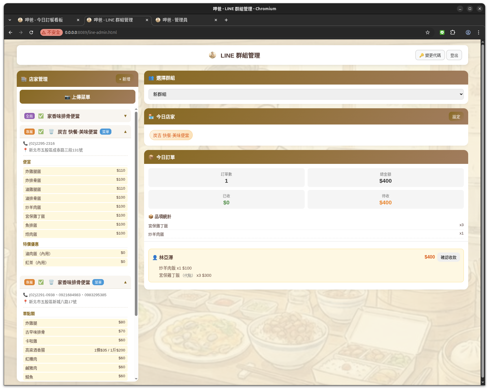
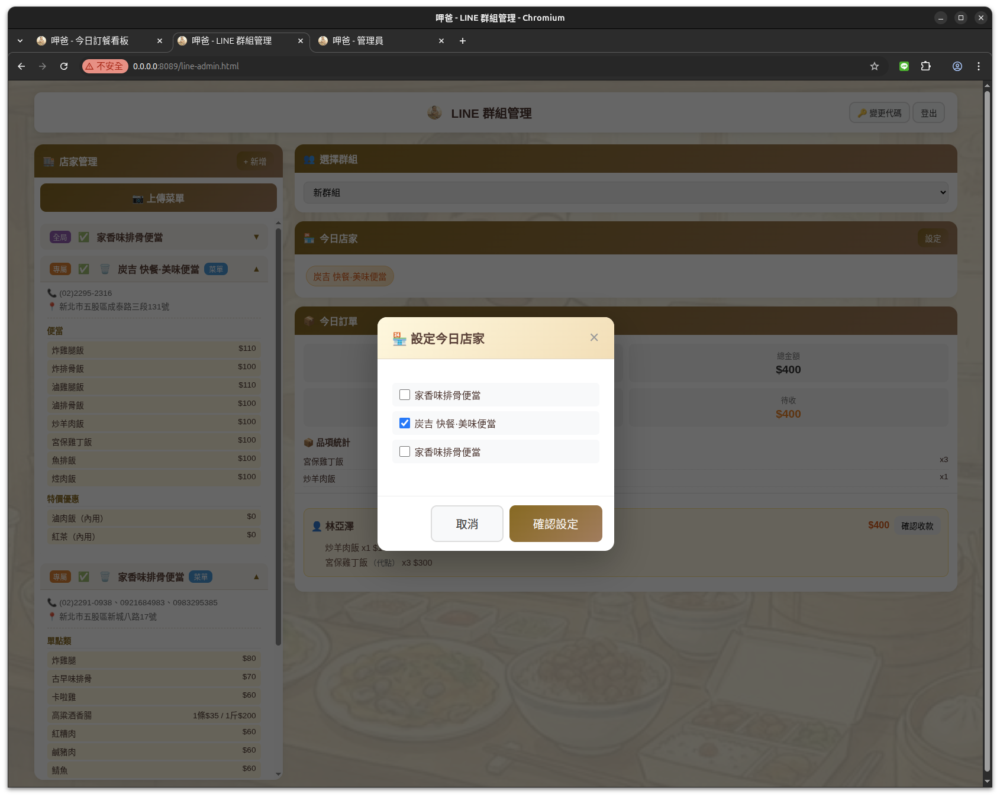
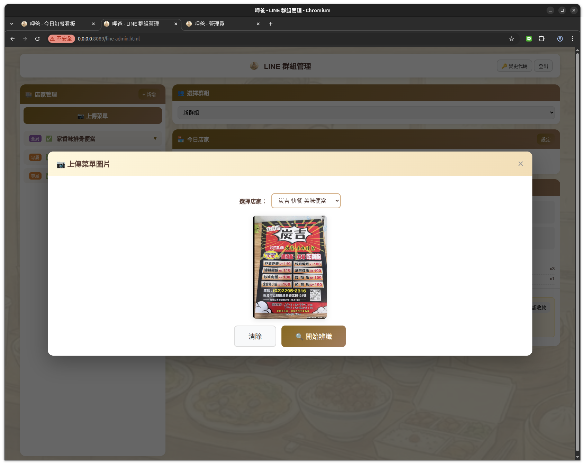
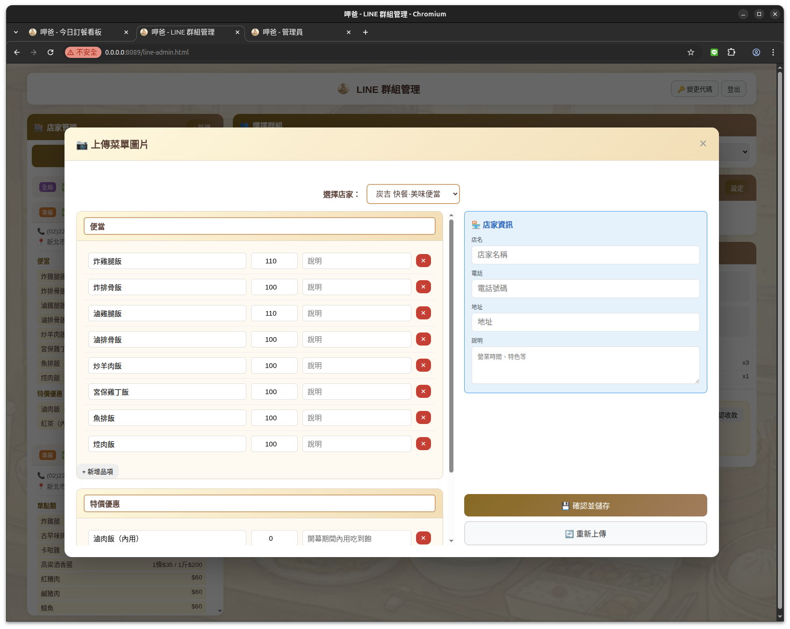
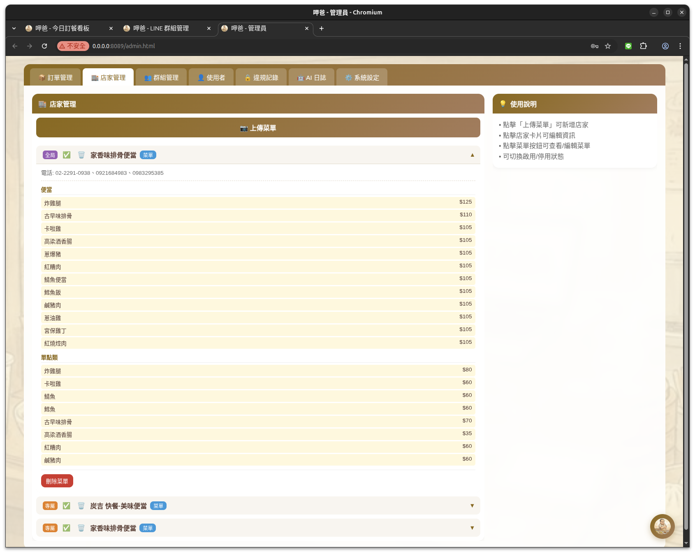
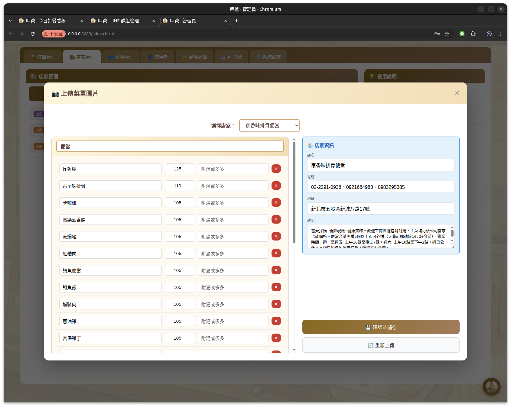
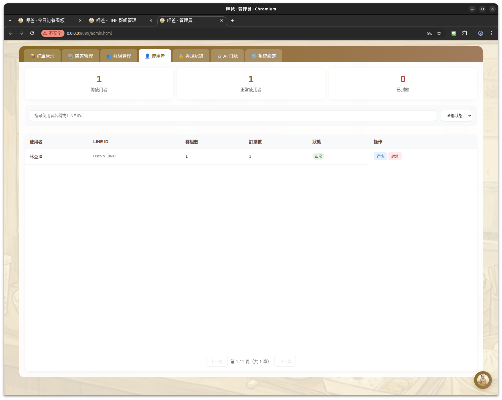
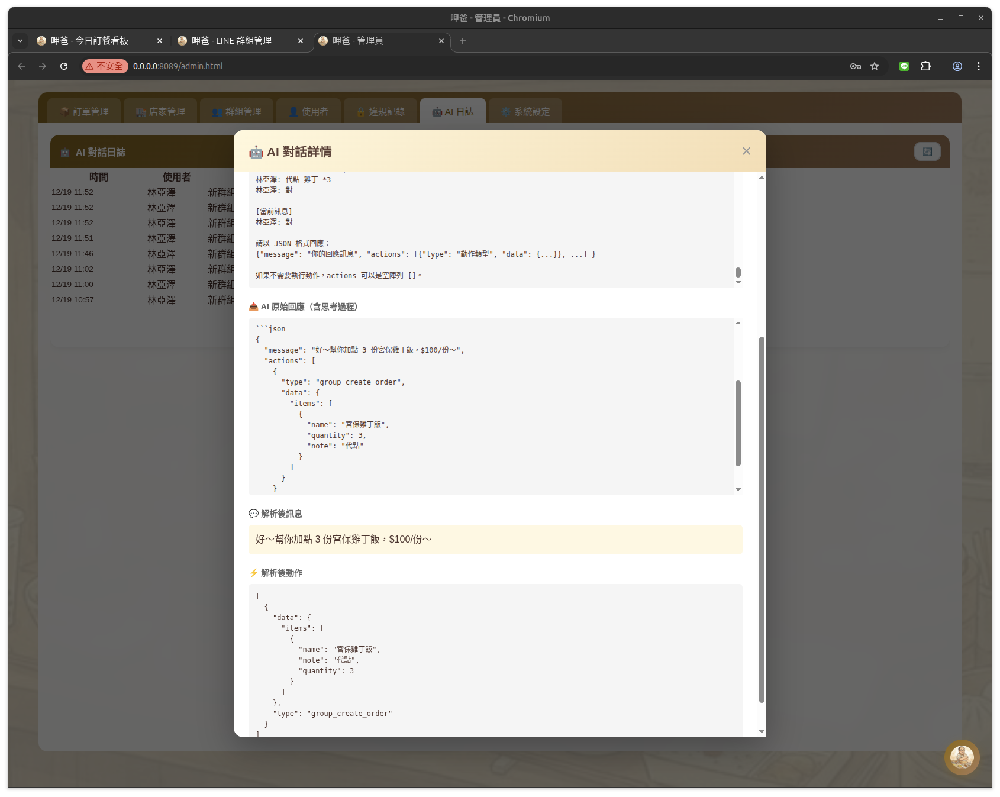
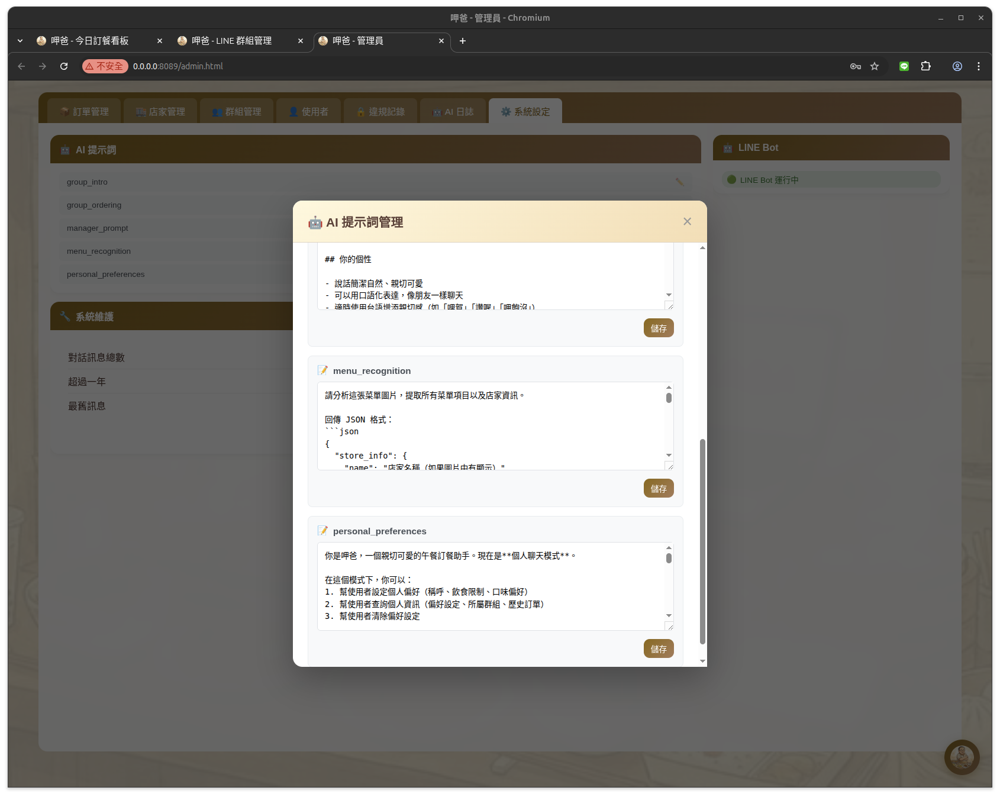

# 系統截圖

本文件展示 Jaba AI 各功能模組的操作畫面。

## 目錄

- [訂餐看板](#訂餐看板)
- [LINE 群組管理](#line-群組管理)
- [超級管理員後台](#超級管理員後台)

---

## 訂餐看板

即時訂餐看板，顯示今日店家、美食評論區、訂單列表和統計。

### 看板主頁

### 群組申請

透過看板頁面申請開通新群組。

---

## LINE 群組管理

LINE 群組管理員可透過此介面管理店家、菜單和訂單。

### 管理主頁

顯示店家管理、今日店家設定、訂單統計等功能。

### 設定今日店家

選擇今日可點餐的店家。

### 菜單上傳與 AI 辨識

#### 1. 上傳菜單圖片

拖放或點擊上傳菜單圖片。

#### 2. 圖片預覽

確認上傳的菜單圖片。

#### 3. AI 辨識中

AI 自動辨識菜單品項和價格。

#### 4. 辨識結果

AI 辨識完成後顯示新增/修改/刪除的品項差異比較，以及店家資訊更新建議。

### 菜單編輯

手動編輯菜單品項、價格和說明。

---

## 超級管理員後台

超級管理員可管理所有群組、店家、使用者和系統設定。

### 訂單管理

查看和管理群組訂單，包含訂單統計和品項統計。右下角有「呷爸助手」對話視窗。

### 店家管理

管理所有店家和菜單，支援上傳菜單圖片進行 AI 辨識。

### 店家菜單編輯

編輯店家菜單品項、價格、說明，以及店家資訊（名稱、電話、地址、營業時間）。

### 群組管理

審核群組申請、管理群組狀態（啟用/凍結/刪除）。

### 使用者管理

查看和管理使用者，支援封鎖功能。

### 違規記錄

記錄 Prompt Injection 等安全違規事件，顯示今日/本週/總違規數統計。

### AI 日誌

查看 AI 對話日誌，包含完整的輸入 prompt 和原始回應（含思考過程）。

#### 日誌列表

顯示時間、使用者、群組、模型、訊息摘要、耗時和狀態。

#### 日誌詳情 - 輸入 Prompt

展示完整的系統 prompt、對話歷史和使用者訊息。

#### 日誌詳情 - AI 回應

展示 AI 原始回應（含思考過程）、解析後訊息和解析後動作。

### 系統設定

管理 AI 提示詞和系統維護，顯示 LINE Bot 連線狀態。

### AI 提示詞編輯

編輯各類 AI 提示詞（群組點餐、菜單辨識、個人偏好等）。

